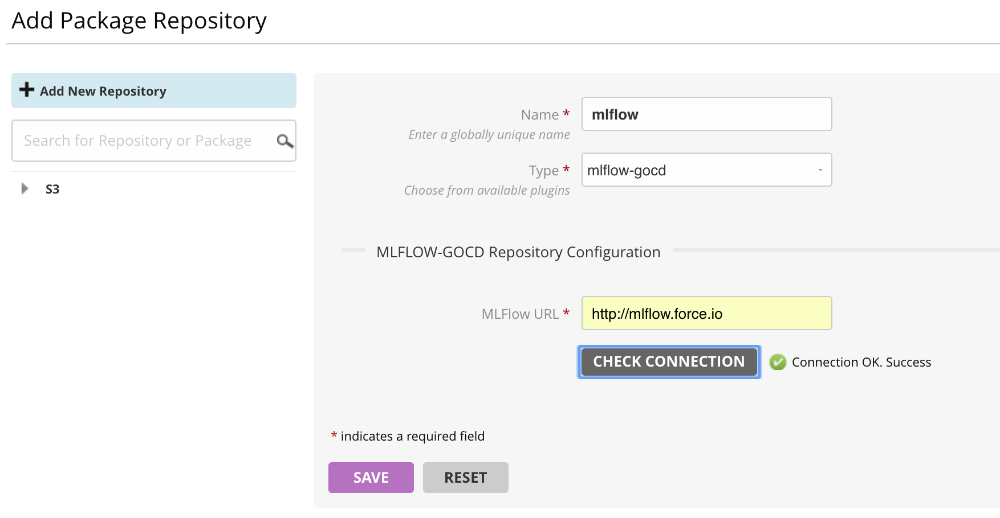
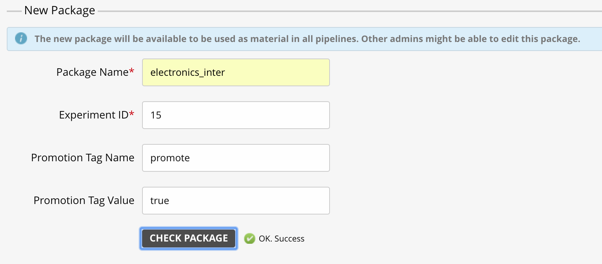
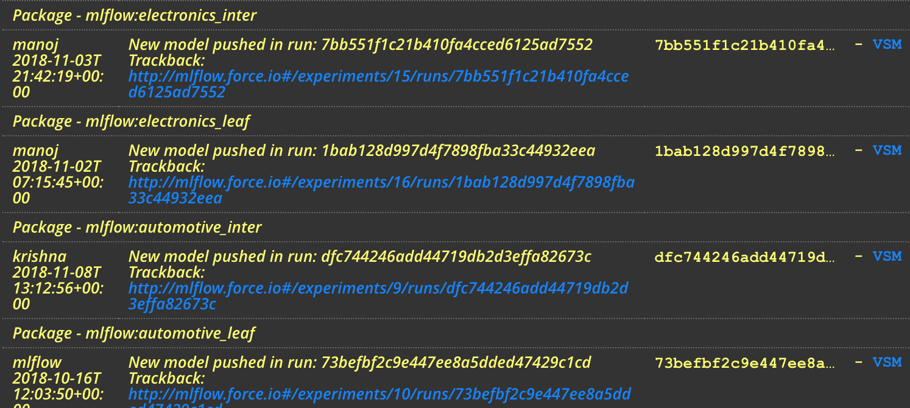

# mlflow-gocd

GoCD plugins to work with MLFlow as model repository

The plugin works with a process where runs within an experiment are "promoted" for production use. A new build is triggered for each promoted run in an experiment and exposes the `artifact_uri` as an environment variable to the build.

Tested on `GoCD 17.2.0+` and `MLFlow 0.7.0`

## Configuring the repository

## Configuring experiments as packages

## Build comment with trackback url

## Fetching models/artifacts from mlflow

Optionally the fetch plugin can also be used in conjunction with the package plugin to fetch artifacts stored in mlflow (backed by S3.)

